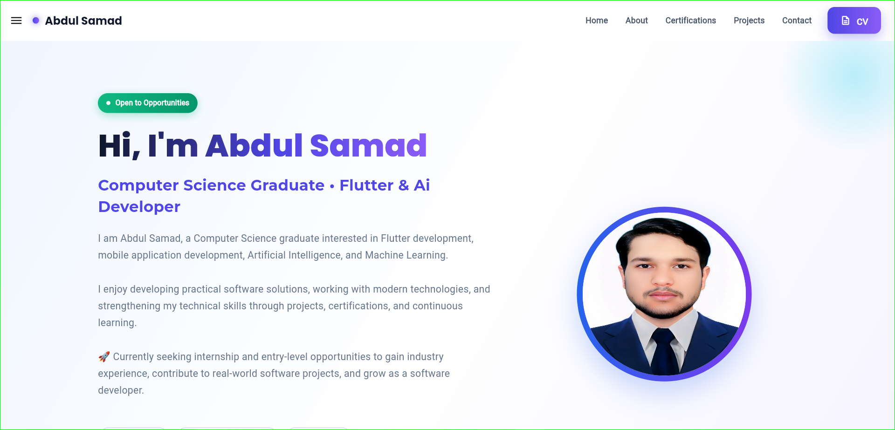

<div align="center">

# 🚀 Flutter Web Portfolio V1

### Abdul Samad's Personal Developer Portfolio

A modern, responsive, and customized personal developer portfolio built with **Flutter Web** to showcase my projects, technical skills, certifications, achievements, and software development journey.

<br>


<br>

<p align="center">
  <a href="https://abdulsamad010.github.io/flutter-web-portfolio-v1/">
    
  </a>
  <a href="https://www.linkedin.com/in/abdulsamad010/">
    
  </a>
</p>

</div>

---

## 🖥️ Portfolio Preview

<div align="center">

[](https://abdulsamad010.github.io/flutter-web-portfolio-v1/)

</div>

<p align="center">
  <em>Click the preview image to explore the live portfolio.</em>
</p>

---

## 📖 About the Project

**Flutter Web Portfolio V1** is my personal developer portfolio created to professionally present my technical background, software development projects, skills, certifications, achievements, professional profiles, and contact information.

The project initially started from an open-source Flutter portfolio template that served as the development foundation.

The original implementation was substantially redesigned, customized, restructured, and improved to create a more modern, responsive, personalized, and professional portfolio experience.

My contributions include improvements to the user interface, responsive behavior, layouts, navigation, portfolio sections, project presentation, reusable components, assets, personal branding, content organization, and overall user experience.

The portfolio is publicly deployed using GitHub Pages and is designed to continuously evolve as I build new projects, gain experience, and expand my technical skills.

---

## ✨ Key Improvements and Contributions

* Redesigned and modernized the original portfolio interface.
* Improved responsiveness across mobile, tablet, laptop, and desktop screen sizes.
* Reworked layouts, spacing, alignment, and component positioning.
* Improved navigation and organization of portfolio sections.
* Added personalized professional information, projects, skills, certifications, and achievements.
* Improved project presentation and portfolio content structure.
* Customized colors, assets, images, icons, typography, and personal branding.
* Modified and improved Flutter components and reusable widgets where required.
* Removed unnecessary template-specific content and functionality.
* Improved code organization, readability, and maintainability where required.
* Tested and refined the portfolio across different screen sizes.
* Prepared the project for continuous updates and future expansion.

---

## 📌 Key Features

* 📱 Responsive Flutter Web interface
* 💻 Desktop, laptop, tablet, and mobile compatibility
* 🎨 Modern and customized user interface
* 👨‍💻 Professional developer profile and introduction
* 🛠️ Technical skills showcase
* 📂 Software development project showcase
* 🎓 Certifications and achievements
* 📄 Direct CV access
* 💼 LinkedIn profile integration
* 💻 GitHub profile integration
* 📧 Professional contact information
* 🧭 Responsive portfolio navigation
* 🖼️ Customized assets and personal branding
* 🧩 Reusable Flutter components
* ⚡ Improved responsiveness and user experience
* 🌐 Public deployment using GitHub Pages
* 🔄 Designed for future portfolio expansion

---

## 🛠️ Technologies Used

| Technology        | Purpose                            |
| ----------------- | ---------------------------------- |
| Flutter           | Cross-platform UI framework        |
| Dart              | Application programming language   |
| Flutter Web       | Web application development        |
| Material Design   | UI components and interface design |
| Responsive Design | Multi-device layout adaptation     |
| Git               | Version control and source history |
| GitHub            | Source code hosting                |
| GitHub Pages      | Production web deployment          |

---

## 📂 Projects Showcased

The portfolio presents academic, personal, mobile application, AI/ML, database, and software development projects.

### 🤖 SmartServeAI

**Intelligent Service Connection Platform – Final Year Project**

A cross-platform service marketplace developed using Flutter, Firebase, Cloudinary, TensorFlow Lite, and NLP-based AI assistance.

### 🧠 AI Face Emotion Detection System

A deep learning-based facial emotion recognition system developed to classify seven human emotions using Python, OpenCV, image preprocessing, model training, and evaluation techniques.

### 🖼️ Image Compression System

A MATLAB-based image processing project implementing image compression, optimization, and noise reduction techniques.

### 🏥 Hospital Management System

A Java-based desktop application developed for managing patient records, diagnosis information, and hospital billing operations.

### 🗄️ Hospital Database Management System

A relational database project focused on hospital data management, database implementation, ERD modeling, and SRS documentation using SQL Server.

### 🛒 Imtiaz Supermarket Billing System

A C++-based supermarket billing and inventory management system featuring product management, shopping cart functionality, invoice generation, quantity handling, and pricing calculations.

### 📞 Phone Book App

A command-line Phone Book application developed using Python with functionality to add, view, edit, and delete contacts using file handling for persistent data storage.

### 🌐 Personal Portfolio Website

This responsive developer portfolio built with Flutter Web to showcase my projects, technical skills, certifications, achievements, and professional profile.

---

## 🚀 Live Demo

The portfolio is publicly deployed using GitHub Pages.

🌐 **Live Portfolio:** [View Live Portfolio](https://abdulsamad010.github.io/flutter-web-portfolio-v1/)

---

## 📦 Installation and Setup

### 1. Clone the Repository

```bash
git clone https://github.com/abdulsamad010/flutter-web-portfolio-v1.git
```

### 2. Navigate to the Project Directory

```bash
cd flutter-web-portfolio-v1
```

### 3. Install Dependencies

```bash
flutter pub get
```

### 4. Check Flutter Configuration

```bash
flutter doctor
```

### 5. Run the Portfolio on Chrome

```bash
flutter run -d chrome
```

---

## 🌐 Build for Web

Generate the production Flutter Web build for GitHub Pages:

```bash
flutter build web --base-href "/flutter-web-portfolio-v1/"
```

The generated production files are available inside:

```text
build/web/
```

---

## 🚀 Deployment

The portfolio is deployed using **GitHub Pages**.

🌐 **Production URL:** [View Live Portfolio](https://abdulsamad010.github.io/flutter-web-portfolio-v1/)

The production Flutter Web build is generated locally using:

```bash
flutter build web --base-href "/flutter-web-portfolio-v1/"
```

The generated contents of `build/web/` are deployed to the `web-deployment` branch.

The repository uses the following branch structure:

* `main` — contains the Flutter source code, README, project files, and development history.
* `web-deployment` — contains only the generated Flutter Web production build used by GitHub Pages.

The generated `build/` directory is not committed to the `main` branch.

Deployment is performed manually after generating the production build locally.

---

## 🔮 Future Improvements

Future updates may include:

* 🔗 Adding GitHub repository links for individual projects as they are published
* 🚀 Adding live demonstrations for supported projects
* 🎬 Further improving animations and transitions
* ⚡ Improving web performance and asset optimization
* ♿ Improving accessibility
* 🔍 Improving SEO and web metadata
* 📱 Continuing responsive design improvements
* 📂 Adding new software development projects
* 🎓 Adding future certifications and achievements
* 🧩 Continuing code structure and maintainability improvements

---

## 🙏 Credits and Attribution

This project was initially based on an open-source Flutter portfolio template created by **Aditya Thakur** and distributed under the **MIT License**.

The original project served as the starting foundation for this portfolio.

The current version has been substantially redesigned, modernized, customized, restructured, and improved by **Abdul Samad**.

My contributions include responsive design improvements, user interface redesigns, layout restructuring, navigation improvements, professional profile integration, personalized portfolio sections, project presentation improvements, asset customization, component modifications, content restructuring, testing, refinement, and additional development work.

Copyright and attribution for portions of the original source code remain with the original copyright holder according to the terms of the MIT License.

Modifications, redesigns, original additions, portfolio content, documentation, and additional development work contributed to this version are authored by **Abdul Samad**.

---

## 📝 License

This project is distributed under the **MIT License**.

This repository contains software derived from an MIT-licensed open-source project.

In accordance with the MIT License requirements, the original copyright and permission notice are preserved.

Copyright for portions of the original source code remains with the original copyright holder.

**Copyright © 2026 Abdul Samad** for original modifications, redesigns, additional code, documentation, portfolio content, and other original contributions made to this version.

See the `LICENSE` file for complete licensing information.

---

## 👨‍💻 Author

### Abdul Samad

**Software Developer | Flutter Developer | AI & Machine Learning Enthusiast**

📍 Islamabad, Pakistan

📧 **Email:** [abdulsamadabbasi010@gmail.com](mailto:abdulsamadabbasi010@gmail.com)

💼 **LinkedIn:** [linkedin.com/in/abdulsamad010](https://www.linkedin.com/in/abdulsamad010/)

💻 **GitHub:** [github.com/abdulsamad010](https://github.com/abdulsamad010)

🌐 **Portfolio:** [View Live Portfolio](https://abdulsamad010.github.io/flutter-web-portfolio-v1/)

📄 **CV / Resume:** [View My Resume](https://drive.google.com/file/d/1SMjEGVuiRPGjZ21Uuweqye90X8RRXp1x/view?usp=sharing)

---

<div align="center">

### ⭐ Support This Project

If you find this portfolio useful or appreciate the work and improvements made to the original template, consider giving the repository a **⭐ Star**.

<br>

[](https://abdulsamad010.github.io/flutter-web-portfolio-v1/)

[](https://www.linkedin.com/in/abdulsamad010/)

<br>

**Made with Flutter 💙 and continuous learning by Abdul Samad**

</div>
